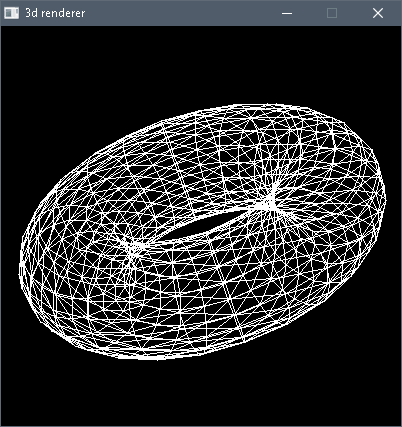

# A SIMPLE 3D RENDERER


Implementing low level algorithms to plot pixels, draw lines (clipping), triangles, shapes and 3D objects (Z-buffer) in 5 rendering modes including Gouraud and Phong shading.\
In C99, and using SDL2 only to plot dots directly to the window surface and manage inputs.\

You can translate and rotate the object in the 3 Axis.\
Phong includes ambiant light effect.\
There's no way to change the light position or its power other than editing the source.\
But with very little changes you can add extra sources of light and make them move around your objects.




#### Wireframe


#### Shaded lines + Z-Buffer


#### Solid fill


#### Gouraud


#### Phong


### Compilation :

##### Linux :

```gcc 3Drenderer.c -std=c99 -pedantic -Wpedantic -Wall -Werror  -O3 -lSDL2 -o 3Drenderer```


##### Windows, using mingw32

```gcc 3Drenderer.c -std=c99 -pedantic -Wpedantic -Wall -Werror -Wl,-subsystem,windows -O3 -lmingw32 -lSDL2main -lSDL2 -o 3Drenderer```


### Usage :

Drag and drop an .obj file in the application window and use the following keys :


```
 - q, w, e   translate + on x, y, z axis
 - a, s, d   translate - on x, y, z axis
 - r, f      increase / decrease viewing distance
 - u, i, o   increase the rotation angles on x, y, z axis
 - j, k, l   decrease the rotation angles on x, y, z axis
 - 1,2,3,4,5 set the rendering mode
 - <space>   reset the rotaion angles

 - any other key : help window
```


You may find some .obj files in the OBJ folder.

They are text files in a very simple format :
- the first two lines are the number of points and faces\
```P 470```\
```F 620```

- then each line starting with a 'p' is a point with its 3 coordinates in floating number\
```p 0.779232 0.710364 0.233913```

- and each line starting with a f is a face (triangle) and refers its 3 vertex\
```f 133 4 134```


Happy Hacking
